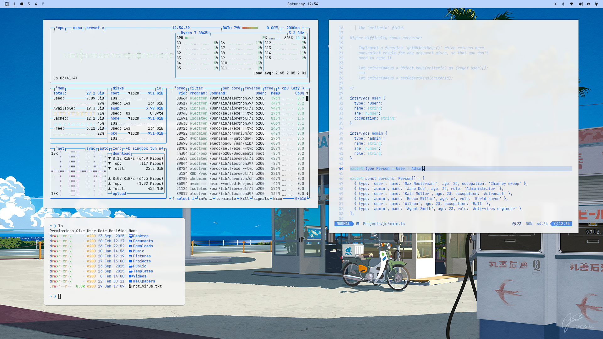

# omarchy-white-air-theme

A clean, modern, high-contrast light theme built for **Omarchy Linux 4.0.0+**.



## Installation

Run the following command in your terminal:

```bash
omarchy theme install https://github.com/o-200/omarchy-white-air-theme
```

Or switch directly if installed locally:

```bash
omarchy theme set white-air
```

## Features

- **Omarchy 4.0.0 Native Specification**: Full `colors.toml` semantic palette with `mode = "light"`, `hyprland_active_border` gradient definitions, and complete ANSI 0-15 light-theme tuning.
- **Omarchy Shell & Hyprland Lua Integration**: Includes `hyprland.lua` for Hyprland window manager rules, rounded borders, active gradients, and window opacity.
- **Enhanced Legibility**: Crisp dark slate typography (`#1e293b`) on pure white background (`#ffffff`) with active sky-blue accenting (`#0a64f5`).
- **Comprehensive App Coverage**:
  - **Terminal Emulators**: Alacritty, Ghostty, Kitty, Foot
  - **Code Editors**: VSCode (`vscode-theme.json`), Neovim (`aether.nvim`), Helix
  - **Desktop Surfaces**: Omarchy Shell, Waybar, Mako, Wofi, Walker, SwayOSD, GTK3/GTK4
  - **System & Productivity**: Btop, Claude Desktop, Obsidian, Pi UI, Warp Terminal, Vencord
